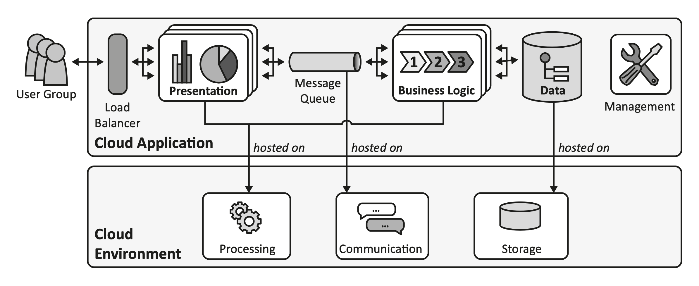

# Cloud Industry

The broad availability of high-speed Internet has reduced the impact of geographic location of hosting environments on
the user experience provided by hosted applications. Advancements in hardware and software management have enabled
hosting providers to offer such IT resources very flexibly and in an automated fashion. _Cloud computing_ is the business
model exploiting this IT evolution. _Cloud providers_ offer numerous IT resources, such as servers, application runtime
environments, or complete applications via self-service interfaces to be used by customers over the Internet. As these
cloud offerings target a large number of customers, providers may leverage economies of scale. Therefore, cloud offerings
are often set up more quickly and with less expense than respective IT resources managed by customers. _Cloud resources_
can commonly be provisioned and decommissioned flexibly, enabling customers to adjust resources to the current demand
of their applications within minutes. The impact of these properties of the cloud environment on hosted applications and
the resulting challenges have been largely unknown. Provider-supplied documentation and architecture guidelines have been
tailored to the specific cloud offerings supported by each provider [[ref](https://d-nb.info/1079525432/34)].

The questions are:
* _Which is the right cloud computing provider for my company?_
* _How do I use the cloud computing products of a certain provider and how do they compare to the products I already have
  in place? We use infrastructure as a service platform already. What is different now?_
* _How does cloud computing impact existing applications if they are moved to the cloud?_
* _How can I use cloud computing to reduce provisioning and setup times, so my users can access servers more quickly?_

Often, these questions were driven by the need to rapidly produce results in big enterprise cloud initiatives that were
founded with the ambitious goals to reduce the cost of IT tremendously and make provisioning of IT resources faster.
We also encountered a general trend that cloud computing initiatives are often driven bottom-up, starting with
infrastructure automation activities. These initiatives, therefore, tend to focus on the IT infrastructure and how to
change its setup, deployment, and management and leave application architecture standards for the enterprise untouched.
Results are company-internal infrastructure-as-a-service offerings that can provision virtual servers in a fast and
efficient manner via a self-service portal [[ref](http://www.asecib.ase.ro/cc/carti/Cloud%20Computing%20Patterns%20[2014].pdf)].

## What is the Industry Problem?

The cloud provider market has been and continues to be extremely diversified, as little standardization among providers
exists. Each provider uses individualized terminology, functionality, access interfaces, service levels, and pricing.
To benefit from economies of scale, cloud providers often target a very large number of customers, thus making the
offered cloud environment a large distributed system. This distribution of IT resources in a cloud environment forces
providers to consider challenges arising from this distribution, such as connectivity ***loss***,
resource ***failures***, and communication ***latency***,
when designing their offerings. The strategies employed by providers to handle these challenges affects the
***complexity*** of the offerings’ internal structure and, thus, impacts the
***price***. Instead of handling these challenges themselves, cloud providers can relay
this complexity to customers. Hosted cloud applications then have to implement the means to address these challenges;
for example, to react to failing cloud resources. As a consequence, different nonfunctional behavior of functionally
similar offerings can lead to varying implications on customer-built applications, which hinders the comparison of offerings.

Development guidelines for cloud applications are often provider-specific to respect the provider’s individual
terminology and behavioral characteristics of provided offerings. Standardization of the cloud offerings with regard to
their interfaces and supported specification formats is currently evolving, but has not been established for the entire
cloud computing market. The aim of providers to ensure distinctive characteristics of their offerings in order to
position their products in the market especially hinders standardization.

However, not only the comparison of cloud providers remains difficult. The comparison of established IT infrastructures
used in companies with new cloud offerings is just as challenging. Often, the price to provision and maintain an IT
resource is the only basis for comparison, which can make a migration to the cloud problematic if the impact of
differences in behavior on hosted applications is neglected.

## What is a Cloud Application?

When discussing cloud environments, the following participant roles and entities are often referred to. A _cloud provider_
makes different _cloud offerings_ accessible to customers. Customers are sometimes referred to as _tenants_. A tenant is a
company or individual using the cloud offering. Each tenant may have a number of associate users accessing the cloud
offering on its behalf. A cloud offering constitutes functionality for processing, communication, or storage to be used
in cloud applications. The granularity of provided functionality is referred to as an IT resource, i.e., a server,
storage space, etc. A special type of IT resource is a _Web service_: this is an application functionality that can be
accessed via a well-defined interface over a network and that displays an "always on" semantic.

A _cloud application_ is hosted in such a cloud environment and relies on different cloud offerings to provide its custom
functionality. An application may experience workload, which is the utilization of IT resources originating from users
accessing the application or automated tasks handled by the application. Workload can be measured in different forms
depending on the IT resource: servers may handle more or fewer processing tasks, storage functionality may have to
handle varying volumes of data, communication components may have to transfer varying quantities of data, etc.

Cloud applications are almost never completely implemented by the application developer, but rely heavily on
cloud-provided offerings:

* _Processing_: Offerings of this type allow the execution of application functionality to handle user requests and
  other tasks. These offerings either host application components or provide functionality that can be integrated with
  application functionality.

* _Communication_: Offerings of this type can be used to exchange information among application components and with
  other applications. Due to the high overlap among cloud architectural principles and properties of message-based
  applications, offerings for asynchronous communication have been especially considered.  

* _Storage_: Offerings of this type can be used to handle data. Cloud providers commonly suggest managing data in
  provider-supplied offerings. Some providers even demand this separation of concerns to simplify the hosting of
  application components, as application components of customers can be scaled more easily and replaced in case of
  failures if these components do not handle data.

* _Load Balancer_: This component is often part of the cloud offering or enabled by well-established technology, such as
  the domain name system (DNS). Customers, however, need to configure this functionality to the requirements of their
  applications.

* _Operation Management_: This component provides functionality that is not directly required to realize the
  functionality offered to application users. Instead, it implements management functionality that ensures the proper
  operation of the application in an automated fashion. Such management functionality, for example, includes elastic
  scaling of the application or handling of failures. Commonly, the cloud provider supplies some offerings that can be
  used to configure operations management.

_IDEAL_ cloud application properties:

* _**I**solated State_: state information (state of the interaction with an application and the data handled by the
  application) is handled by a minimal number of application components and preferably in data storage functionality
  offered by cloud providers. This isolation eases the scaling and ***resiliency***
  with respect to failures of the application.

* _**D**istribution_: the application functionality is spread out among multiple components to be deployed on multiple
  cloud resources. As the cloud environment is by nature a large distributed system, application functionality is
  distributed in a similar manner.

* _**E**lasticity_: the application is enabled to add and remove required resources during runtime. This addition and
  removal occurs without affecting the application user.

* _**A**utomated Management_: to react promptly to failures and changed resource demand, the corresponding management
  operations are automated and do not involve any human interaction.

* _**L**oose Coupling_: the dependencies among application components are reduced to ease addition and removal in the
  scope of elasticity management and ***resiliency***.

Mapping of _cloud environment requirements_ to cloud application properties:

Mapping of _distributed system properties_ to cloud application properties:

Mapping of _messaging properties_ to cloud application properties:

Mapping of _REST constraints_ to cloud application properties:

Mapping of _SOA concepts_ to cloud application properties:

## Compliance to Laws and Regulations

Companies are required to respect numerous laws and corporate regulations in their IT infrastructure setup, runtime
management, and applications. Regulations often target the storage location and accessibility of data as described,
for example, by the Federal Data Protection Act in Germany. Also, regulations often involve audits performed by external
third parties. In a virtualized environment, these compliance requirements can be difficult to fulfill: cloud providers
may obfuscate the exact location of data, and examining the physical hardware can be impossible for human auditors.
Another challenge that companies face can be the unauthorized use of external cloud resources. As public cloud offerings
may be more flexible than company internal services, departments or individual employees may be driven towards using
cloud services, such as Dropbox.

Regarding compliance, cloud computing introduces the challenge that a company’s IT has to compete with public cloud
services. Methods concerning how to address these issues have been investigated
[[ref](https://dsg.tuwien.ac.at/team/ivona/papers/Cloud2010_Brandic.pdf)].

## See Also

* [Design patterns](docs/design-patterns.md)