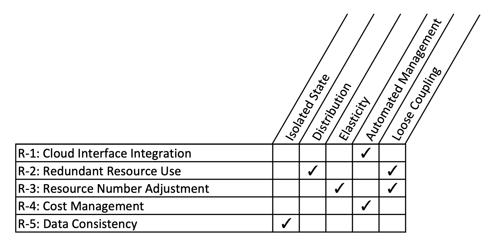
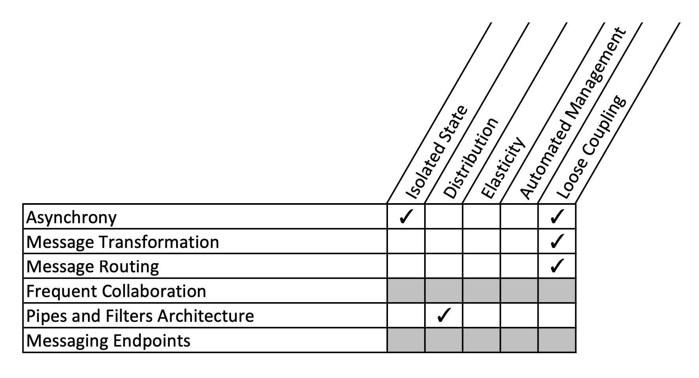
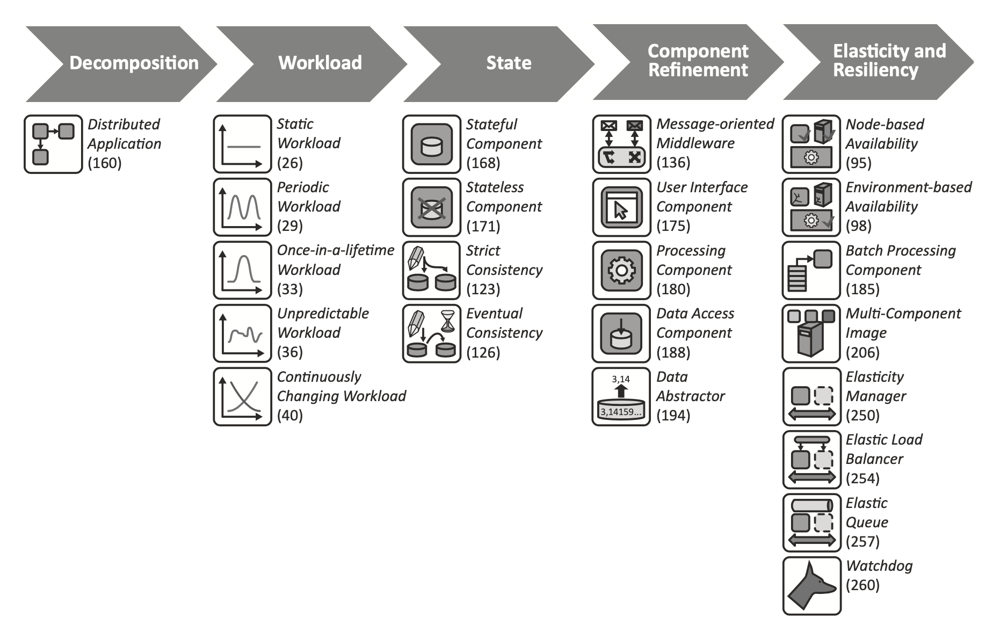

# Cloud Industry

The broad availability of high-speed Internet has reduced the impact of geographic location of hosting environments on
the user experience provided by hosted applications. Advancements in hardware and software management have enabled
hosting providers to offer such IT resources very flexibly and in an automated fashion. _Cloud computing_ is the business
model exploiting this IT evolution. _Cloud providers_ offer numerous IT resources, such as servers, application runtime
environments, or complete applications via self-service interfaces to be used by customers over the Internet. As these
cloud offerings target a large number of customers, providers may leverage economies of scale. Therefore, cloud offerings
are often set up more quickly and with less expense than respective IT resources managed by customers. _Cloud resources_
can commonly be provisioned and decommissioned flexibly, enabling customers to adjust resources to the current demand
of their applications within minutes. The impact of these properties of the cloud environment on hosted applications and
the resulting challenges have been largely unknown. Provider-supplied documentation and architecture guidelines have been
tailored to the specific cloud offerings supported by each provider [[ref](https://d-nb.info/1079525432/34)].

The questions are:
* _Which is the right cloud computing provider for my company?_
* _How do I use the cloud computing products of a certain provider and how do they compare to the products I already have
  in place? We use infrastructure as a service platform already. What is different now?_
* _How does cloud computing impact existing applications if they are moved to the cloud?_
* _How can I use cloud computing to reduce provisioning and setup times, so my users can access servers more quickly?_

Often, these questions were driven by the need to rapidly produce results in big enterprise cloud initiatives that were
founded with the ambitious goals to reduce the cost of IT tremendously and make provisioning of IT resources faster.
We also encountered a general trend that cloud computing initiatives are often driven bottom-up, starting with
infrastructure automation activities. These initiatives, therefore, tend to focus on the IT infrastructure and how to
change its setup, deployment, and management and leave application architecture standards for the enterprise untouched.
Results are company-internal infrastructure-as-a-service offerings that can provision virtual servers in a fast and
efficient manner via a self-service portal [[ref](http://www.asecib.ase.ro/cc/carti/Cloud%20Computing%20Patterns%20[2014].pdf)].

## What is the Industry Problem?

The cloud provider market has been and continues to be extremely diversified, as little standardization among providers
exists. Each provider uses individualized terminology, functionality, access interfaces, service levels, and pricing.
To benefit from economies of scale, cloud providers often target a very large number of customers, thus making the
offered cloud environment a large distributed system. This distribution of IT resources in a cloud environment forces
providers to consider challenges arising from this distribution, such as connectivity ***loss***,
resource ***failures***, and communication ***latency***,
when designing their offerings. The strategies employed by providers to handle these challenges affects the
***complexity*** of the offerings’ internal structure and, thus, impacts the
***price***. Instead of handling these challenges themselves, cloud providers can relay
this complexity to customers. Hosted cloud applications then have to implement the means to address these challenges;
for example, to react to failing cloud resources. As a consequence, different nonfunctional behavior of functionally
similar offerings can lead to varying implications on customer-built applications, which hinders the comparison of offerings.

Development guidelines for cloud applications are often provider-specific to respect the provider’s individual
terminology and behavioral characteristics of provided offerings. Standardization of the cloud offerings with regard to
their interfaces and supported specification formats is currently evolving, but has not been established for the entire
cloud computing market. The aim of providers to ensure distinctive characteristics of their offerings in order to
position their products in the market especially hinders standardization.

However, not only the comparison of cloud providers remains difficult. The comparison of established IT infrastructures
used in companies with new cloud offerings is just as challenging. Often, the price to provision and maintain an IT
resource is the only basis for comparison, which can make a migration to the cloud problematic if the impact of
differences in behavior on hosted applications is neglected.

## What is a Cloud Application?

When discussing cloud environments, the following participant roles and entities are often referred to. A _cloud provider_
makes different _cloud offerings_ accessible to customers. Customers are sometimes referred to as _tenants_. A tenant is a
company or individual using the cloud offering. Each tenant may have a number of associate users accessing the cloud
offering on its behalf. A cloud offering constitutes functionality for processing, communication, or storage to be used
in cloud applications. The granularity of provided functionality is referred to as an IT resource, i.e., a server,
storage space, etc. A special type of IT resource is a _Web service_: this is an application functionality that can be
accessed via a well-defined interface over a network and that displays an "always on" semantic.

A _cloud application_ is hosted in such a cloud environment and relies on different cloud offerings to provide its custom
functionality. An application may experience workload, which is the utilization of IT resources originating from users
accessing the application or automated tasks handled by the application. Workload can be measured in different forms
depending on the IT resource: servers may handle more or fewer processing tasks, storage functionality may have to
handle varying volumes of data, communication components may have to transfer varying quantities of data, etc.

Cloud applications are almost never completely implemented by the application developer, but rely heavily on
cloud-provided offerings:

* _Processing_: Offerings of this type allow the execution of application functionality to handle user requests and
  other tasks. These offerings either host application components or provide functionality that can be integrated with
  application functionality.

* _Communication_: Offerings of this type can be used to exchange information among application components and with
  other applications. Due to the high overlap among cloud architectural principles and properties of message-based
  applications, offerings for asynchronous communication have been especially considered.  

* _Storage_: Offerings of this type can be used to handle data. Cloud providers commonly suggest managing data in
  provider-supplied offerings. Some providers even demand this separation of concerns to simplify the hosting of
  application components, as application components of customers can be scaled more easily and replaced in case of
  failures if these components do not handle data.

* _Load Balancer_: This component is often part of the cloud offering or enabled by well-established technology, such as
  the domain name system (DNS). Customers, however, need to configure this functionality to the requirements of their
  applications.

* _Operation Management_: This component provides functionality that is not directly required to realize the
  functionality offered to application users. Instead, it implements management functionality that ensures the proper
  operation of the application in an automated fashion. Such management functionality, for example, includes elastic
  scaling of the application or handling of failures. Commonly, the cloud provider supplies some offerings that can be
  used to configure operations management.

_IDEAL_ cloud application properties:

* _**I**solated State_: state information (state of the interaction with an application and the data handled by the
  application) is handled by a minimal number of application components and preferably in data storage functionality
  offered by cloud providers. This isolation eases the scaling and ***resiliency***
  with respect to failures of the application.

* _**D**istribution_: the application functionality is spread out among multiple components to be deployed on multiple
  cloud resources. As the cloud environment is by nature a large distributed system, application functionality is
  distributed in a similar manner.

* _**E**lasticity_: the application is enabled to add and remove required resources during runtime. This addition and
  removal occurs without affecting the application user.

* _**A**utomated Management_: to react promptly to failures and changed resource demand, the corresponding management
  operations are automated and do not involve any human interaction.

* _**L**oose Coupling_: the dependencies among application components are reduced to ease addition and removal in the
  scope of elasticity management and ***resiliency***.

Mapping of _cloud environment requirements_ to cloud application properties:

Mapping of _distributed system properties_ to cloud application properties:

Mapping of _messaging properties_ to cloud application properties:

Mapping of _REST constraints_ to cloud application properties:

Mapping of _SOA concepts_ to cloud application properties:

## Compliance to Laws and Regulations

Companies are required to respect numerous laws and corporate regulations in their IT infrastructure setup, runtime
management, and applications. Regulations often target the storage location and accessibility of data as described,
for example, by the Federal Data Protection Act in Germany. Also, regulations often involve audits performed by external
third parties. In a virtualized environment, these compliance requirements can be difficult to fulfill: cloud providers
may obfuscate the exact location of data, and examining the physical hardware can be impossible for human auditors.
Another challenge that companies face can be the unauthorized use of external cloud resources. As public cloud offerings
may be more flexible than company internal services, departments or individual employees may be driven towards using
cloud services, such as Dropbox.

Regarding compliance, cloud computing introduces the challenge that a company’s IT has to compete with public cloud
services. Methods concerning how to address these issues have been investigated
[[ref](https://dsg.tuwien.ac.at/team/ivona/papers/Cloud2010_Brandic.pdf)].

## Design Patterns

Phases of the pattern-based design method for cloud applications and patterns considered during each phase:

### Amazon Web Services

The cloud design patterns for Amazon Web Services describe common designs for applications running on the Amazon cloud
and are claimed to be obtained from existing applications running at this cloud provider.

Basic Patterns:
* [Snapshot Pattern (Data Backups)](http://en.clouddesignpattern.org/index.php/CDP:Snapshot_Pattern)
* [Stamp Pattern (Server Replication)](http://en.clouddesignpattern.org/index.php/CDP:Stamp_Pattern)
* [Scale Up Pattern (Dynamic Server Spec Up/Down)](http://en.clouddesignpattern.org/index.php/CDP:Scale_Up_Pattern)
* [Scale Out Pattern (Dynamically Increasing the Number of Servers)](http://en.clouddesignpattern.org/index.php/CDP:Scale_Out_Pattern)
* [On-demand Disk Pattern (Dynamically Increasing/Decreasing Disk Capacity)](http://en.clouddesignpattern.org/index.php/CDP:Ondemand_Disk_Pattern)

High Availability:

* [Multi-Server Pattern (Server Redundancy)](http://en.clouddesignpattern.org/index.php/CDP:Multi-Server_Pattern)
* [Multi-Datacenter Pattern (Redundancy on the Data Center Level)](http://en.clouddesignpattern.org/index.php/CDP:Multi-Datacenter_Pattern)
* [Floating IP Pattern (Floating IP Address)](http://en.clouddesignpattern.org/index.php/CDP:Floating_IP_Pattern)
* [Deep Health Check Pattern (System Health Check)](http://en.clouddesignpattern.org/index.php/CDP:Deep_Health_Check_Pattern)

Processing Dynamic Content:
* [Clone Server Pattern (Cloning a Server)](http://en.clouddesignpattern.org/index.php/CDP:Clone_Server_Pattern)
* [NFS Sharing Pattern (Using Shared Content)](http://en.clouddesignpattern.org/index.php/CDP:NFS_Sharing_Pattern)
* [NFS Replica Pattern (Replicating Shared Content)](http://en.clouddesignpattern.org/index.php/CDP:NFS_Replica_Pattern)
* [State Sharing Pattern (Sharing State Information)](http://en.clouddesignpattern.org/index.php/CDP:State_Sharing_Pattern)
* [URL Rewriting Pattern (Saving Static Content)](http://en.clouddesignpattern.org/index.php/CDP:URL_Rewriting_Pattern)
* [Rewrite Proxy Pattern (Proxy Setup for URL Overwriting)](http://en.clouddesignpattern.org/index.php/CDP:Rewrite_Proxy_Pattern)
* [Cache Proxy Pattern (Cache Provisioning)](http://en.clouddesignpattern.org/index.php/CDP:Cache_Proxy_Pattern)
* [Scheduled Scale Out Pattern (Increasing or Decreasing the Number of Servers Following a Schedule)](http://en.clouddesignpattern.org/index.php/CDP:Scheduled_Scale_Out_Pattern)

Processing Static Content:
* [Web Storage Pattern (Use of High-Availability Internet Storage)](http://en.clouddesignpattern.org/index.php/CDP:Web_Storage_Pattern)
* [Direct Hosting Pattern (Direct Hosting Using Internet Storage)](http://en.clouddesignpattern.org/index.php/CDP:Direct_Hosting_Pattern)
* [Private Distribution Pattern (Data Delivery to Specified Users)](http://en.clouddesignpattern.org/index.php/CDP:Private_Distribution_Pattern)
* [Cache Distribution Pattern (Locating Data in a Location That Is Physically Near to the User)](http://en.clouddesignpattern.org/index.php/CDP:Cache_Distribution_Pattern)
* [Rename Distribution Pattern (Delivery Without Update Delay)](http://en.clouddesignpattern.org/index.php/CDP:Rename_Distribution_Pattern)

Uploading Data:
* [Write Proxy Pattern (High-Speed Uploading to Internet Storage)](http://en.clouddesignpattern.org/index.php/CDP:Write_Proxy_Pattern)
* [Storage Index Pattern (Increasing the Efficiency of Internet Storage)](http://en.clouddesignpattern.org/index.php/CDP:Storage_Index_Pattern)
* [Direct Object Upload Pattern (Simplifying the Upload Procedure)](http://en.clouddesignpattern.org/index.php/CDP:Direct_Object_Upload_Pattern)

Relational Database:
* [DB Replication Pattern (Replicating Online Databases)](http://en.clouddesignpattern.org/index.php/CDP:DB_Replication_Pattern)
* [Read Replica Pattern (Load Distribution through Read Replicas)](http://en.clouddesignpattern.org/index.php/CDP:Read_Replica_Pattern)
* [In-memory DB Cache Pattern (Caching High-Frequency Data)](http://en.clouddesignpattern.org/index.php/CDP:Inmemory_DB_Cache_Pattern)
* [Sharding Write Pattern (Improving Efficiency in Writing)](http://en.clouddesignpattern.org/index.php/CDP:Sharding_Write_Pattern)

Batch Processing:
* [Queuing Chain Pattern (Loose-Coupling of Systems)](http://en.clouddesignpattern.org/index.php/CDP:Queuing_Chain_Pattern)
* [Priority Queue pattern (Changing Priorities)](http://en.clouddesignpattern.org/index.php/CDP:Priority_Queue_Pattern)
* [Job Observer Pattern (Job Monitoring and Adding/Deleting Servers)](http://en.clouddesignpattern.org/index.php/CDP:Job_Observer_Pattern)
* [Scheduled Autoscaling Pattern (Turning Batch Servers On and Off Automatically)](http://en.clouddesignpattern.org/index.php/CDP:Scheduled_Autoscaling_Pattern)

Operation and Maintenance:
* [Bootstrap Pattern (Automatic Acquisition of Startup Settings)](http://en.clouddesignpattern.org/index.php/CDP:Bootstrap_Pattern)
* [Cloud DI Pattern (External Placement of Parts That Are Frequently Updated)](http://en.clouddesignpattern.org/index.php/CDP:Cloud_DI_Pattern)
* [Stack Deployment Pattern (Creating a Template for Setting up Groups of Servers)](http://en.clouddesignpattern.org/index.php/CDP:Stack_Deployment_Pattern)
* [Server Swapping Pattern (Transferring Servers)](http://en.clouddesignpattern.org/index.php/CDP:Server_Swapping_Pattern)
* [Monitoring Integration Pattern (Centralization of Monitoring Tools)](http://en.clouddesignpattern.org/index.php/CDP:Monitoring_Integration_Pattern)
* [Web Storage Archive Pattern (Archiving Large Volumes of Data)](http://en.clouddesignpattern.org/index.php/CDP:Web_Storage_Archive_Pattern)
* [Weighted Transition Pattern (Transitioning Using a Weighted Round Robin DNS)](http://en.clouddesignpattern.org/index.php/CDP:Weighted_Transition_Pattern)
* [Hybrid Backup Pattern (Using the Cloud for Backups)](http://en.clouddesignpattern.org/index.php/CDP:Hybrid_Backup_Pattern)

Network:
* [OnDemand NAT Pattern (Changing Internet Settings at the Time of Maintenance)](http://en.clouddesignpattern.org/index.php/CDP:OnDemand_NAT_Pattern)
* [Back-net Pattern (Establishment of a Management Network)](http://en.clouddesignpattern.org/index.php/CDP:Backnet_Pattern)
* [Functional Firewall Pattern (Multi-Tier Access Control)](http://en.clouddesignpattern.org/index.php/CDP:Functional_Firewall_Pattern)
* [Operational Firewall Pattern (Controlling Access by Individual Function)](http://en.clouddesignpattern.org/index.php/CDP:Operational_Firewall_Pattern)
* [Multi Load Balancer Pattern (Setting Up Multiple Load Balancers)](http://en.clouddesignpattern.org/index.php/CDP:Multi_Load_Balancer_Pattern)
* [WAF Proxy Pattern (Effective Use of a Costly Web Application Firewalls)](http://en.clouddesignpattern.org/index.php/CDP:WAF_Proxy_Pattern)
* [CloudHub Pattern (Setting Up VPN Sites)](http://en.clouddesignpattern.org/index.php/CDP:CloudHub_Pattern)

### Microsoft Azure

The cloud design patterns for Microsoft Azure provide a set of patterns for cloud applications considering distributed
systems in general, cloud applications, and Microsoft Azure. While these patterns clearly focus on Azure, the authors
claim that presented concepts are generally applicable.

* [Cache-aside Pattern](https://docs.microsoft.com/en-us/previous-versions/msp-n-p/dn589799(v=pandp.10))
* [Circuit Breaker Pattern](https://docs.microsoft.com/en-us/previous-versions/msp-n-p/dn589784(v=pandp.10))
* [Compensating Transaction Pattern](https://docs.microsoft.com/en-us/previous-versions/msp-n-p/dn589804(v=pandp.10))
* [Competing Consumers Pattern](https://docs.microsoft.com/en-us/previous-versions/msp-n-p/dn568101(v=pandp.10))
* [Compute Resource Consolidation Pattern](https://docs.microsoft.com/en-us/previous-versions/msp-n-p/dn589778(v=pandp.10))
* [Command and Query Responsibility Segregation (CQRS) Pattern](https://docs.microsoft.com/en-us/previous-versions/msp-n-p/dn568103(v=pandp.10))
* [Event Sourcing Pattern](https://docs.microsoft.com/en-us/previous-versions/msp-n-p/dn589792(v=pandp.10))
* [External Configuration Store Pattern](https://docs.microsoft.com/en-us/previous-versions/msp-n-p/dn589803(v=pandp.10))
* [Federated Identity Pattern](https://docs.microsoft.com/en-us/previous-versions/msp-n-p/dn589790(v=pandp.10))
* [Gatekeeper Pattern](https://docs.microsoft.com/en-us/previous-versions/msp-n-p/dn589793(v=pandp.10))
* [Health Endpoint Monitoring Pattern](https://docs.microsoft.com/en-us/previous-versions/msp-n-p/dn589789(v=pandp.10))
* [Index Table Pattern](https://docs.microsoft.com/en-us/previous-versions/msp-n-p/dn589791(v=pandp.10))
* [Leader Election Pattern](https://docs.microsoft.com/en-us/previous-versions/msp-n-p/dn568104(v=pandp.10))
* [Materialized View Pattern](https://docs.microsoft.com/en-us/previous-versions/msp-n-p/dn589782(v=pandp.10))
* [Pipes and Filters Pattern](https://docs.microsoft.com/en-us/previous-versions/msp-n-p/dn568100(v=pandp.10))
* [Priority Queue Pattern](https://docs.microsoft.com/en-us/previous-versions/msp-n-p/dn589794(v=pandp.10))
* [Queue-based Load Leveling Pattern](https://docs.microsoft.com/en-us/previous-versions/msp-n-p/dn589783(v=pandp.10))
* [Retry Pattern](https://docs.microsoft.com/en-us/previous-versions/msp-n-p/dn589788(v=pandp.10))
* [Runtime Reconfiguration Pattern](https://docs.microsoft.com/en-us/previous-versions/msp-n-p/dn589785(v=pandp.10))
* [Scheduler Agent Supervisor Pattern](https://docs.microsoft.com/en-us/previous-versions/msp-n-p/dn589780(v=pandp.10))
* [Sharding Pattern](https://docs.microsoft.com/en-us/previous-versions/msp-n-p/dn589797(v=pandp.10))
* [Static Content Hosting Pattern](https://docs.microsoft.com/en-us/previous-versions/msp-n-p/dn589776(v=pandp.10))
* [Throttling Pattern](https://docs.microsoft.com/en-us/previous-versions/msp-n-p/dn589798(v=pandp.10))
* [Valet Key Pattern](https://docs.microsoft.com/en-us/previous-versions/msp-n-p/dn568102(v=pandp.10))

### Bill Wilder (O'Reilly)

The cloud architecture patterns that are considered to be generally applicable to cloud computing applications. Their
exemplary use in a photo-sharing application throughout the book considers _Windows Azure_ as the development platform.
Other cloud providers are not considered.

* Scalability Primer
* Horizontally Scaling Compute Pattern
* Queue-Centric Workflow Pattern
* Auto-Scaling Pattern
* Eventual Consistency Primer
* MapReduce Pattern
* Database Sharding Pattern
* Multitenancy and Commodity Hardware Primer
* Busy Signal Pattern
* Node Failure Pattern
* Network Latency Pattern
* Colocate Pattern
* Valet Key Pattern
* CDN Pattern
* Multisite Deployment Pattern

### CloudPatterns.org

The focus of the patterns of cloudpatterns.org on cloud-building technologies, concepts, and architectures motivates
their mapping to the cloud computing patterns, which focus on building applications for the cloud – not the cloud itself.

Sharing, Scaling and Elasticity Patterns:

* [Broad Access](https://patterns.arcitura.com/cloud-computing-patterns/design_patterns/broad_access)
* [Cross-Storage Device Vertical Tiering](https://patterns.arcitura.com/cloud-computing-patterns/design_patterns/cross_storage_device_vertical_tiering)
* [Dynamic Data Normalization](https://patterns.arcitura.com/cloud-computing-patterns/design_patterns/dynamic_data_normalization)
* [Dynamic Scalability](https://patterns.arcitura.com/cloud-computing-patterns/design_patterns/dynamic_scalability)
* [Elastic Disk Provisioning](https://patterns.arcitura.com/cloud-computing-patterns/design_patterns/elastic_disk_provisioning)
* [Elastic Network Capacity](https://patterns.arcitura.com/cloud-computing-patterns/design_patterns/elastic_network_capacity)
* [Elastic Resource Capacity](https://patterns.arcitura.com/cloud-computing-patterns/design_patterns/elastic_resource_capacity)
* [Intra-Storage Device Vertical Data Tiering](https://patterns.arcitura.com/cloud-computing-patterns/design_patterns/intra_storage_device_vertical_data_tiering)
* [Load Balanced Virtual Server Instances](https://patterns.arcitura.com/cloud-computing-patterns/design_patterns/load_balanced_virtual_server_instances)
* [Load Balanced Virtual Switches](https://patterns.arcitura.com/cloud-computing-patterns/design_patterns/load_balanced_virtual_switches)
* [Memory Over-Committing](https://patterns.arcitura.com/cloud-computing-patterns/design_patterns/memory_over_committing)
* [NIC Teaming](https://patterns.arcitura.com/cloud-computing-patterns/design_patterns/nic_teaming)
* [Service Load Balancing](https://patterns.arcitura.com/cloud-computing-patterns/design_patterns/service_load_balancing)
* [Service State Management](https://patterns.arcitura.com/cloud-computing-patterns/design_patterns/service_state_management)
* [Shared Resources](https://patterns.arcitura.com/cloud-computing-patterns/design_patterns/shared_resources)
* [Storage Workload Management](https://patterns.arcitura.com/cloud-computing-patterns/design_patterns/storage_workload_management)
* [Workload Distribution](https://patterns.arcitura.com/cloud-computing-patterns/design_patterns/workload_distribution)

***Reliability***, ***Resiliency*** and Recovery Patterns:

* [Dynamic Failure Detection and Recovery](https://patterns.arcitura.com/cloud-computing-patterns/design_patterns/dynamic_failure_detection_and_recovery)
* [Hypervisor Clustering](https://patterns.arcitura.com/cloud-computing-patterns/design_patterns/hypervisor_clustering)
* [Multipath Resource Access](https://patterns.arcitura.com/cloud-computing-patterns/design_patterns/multipath_resource_access)
* [Non-Disruptive Service Relocation](https://patterns.arcitura.com/cloud-computing-patterns/design_patterns/non_disruptive_service_relocation)
* [Redundant Physical Connection for Virtual Servers](https://patterns.arcitura.com/cloud-computing-patterns/design_patterns/redundant_physical_connection_for_virtual_servers)
* [Redundant Storage](https://patterns.arcitura.com/cloud-computing-patterns/design_patterns/redundant_storage)
* [Resource Pooling](https://patterns.arcitura.com/cloud-computing-patterns/design_patterns/resource_pooling)
* [Resource Reservation](https://patterns.arcitura.com/cloud-computing-patterns/design_patterns/resource_reservation)
* [Storage Maintenance Window](https://patterns.arcitura.com/cloud-computing-patterns/design_patterns/storage_maintenance_window)
* [Synchronized Operating State](https://patterns.arcitura.com/cloud-computing-patterns/design_patterns/synchronized_operating_state)
* [Virtual Server Auto Crash Recovery](https://patterns.arcitura.com/cloud-computing-patterns/design_patterns/virtual_server_auto_crash_recovery)
* [Zero Downtime](https://patterns.arcitura.com/cloud-computing-patterns/design_patterns/zero_downtime)

Data Management and Storage Device Patterns:

* [Direct I/O Access](https://patterns.arcitura.com/cloud-computing-patterns/design_patterns/direct_io_access)
* [Direct LUN Access](https://patterns.arcitura.com/cloud-computing-patterns/design_patterns/direct_lun_access)
* [Single Root I/O Virtualization](https://patterns.arcitura.com/cloud-computing-patterns/design_patterns/single_root_i_o_virtualization)
* [Cloud Storage Data at Rest Encryption](https://patterns.arcitura.com/cloud-computing-patterns/design_patterns/cloud_storage_data_at_rest_encryption)
* [Cloud Storage Data Lifecycle Management](https://patterns.arcitura.com/cloud-computing-patterns/design_patterns/cloud_storage_data_lifecycle_management)
* [Cloud Storage Data Management](https://patterns.arcitura.com/cloud-computing-patterns/design_patterns/cloud_storage_data_management)
* [Cloud Storage Data Placement Compliance Check](https://patterns.arcitura.com/cloud-computing-patterns/design_patterns/cloud_storage_data_placement_compliance_check)
* [Cloud Storage Device Masking](https://patterns.arcitura.com/cloud-computing-patterns/design_patterns/cloud_storage_device_masking)
* [Cloud Storage Device Path Masking](https://patterns.arcitura.com/cloud-computing-patterns/design_patterns/cloud_storage_device_path_masking)
* [Cloud Storage Device Performance Enforcement](https://patterns.arcitura.com/cloud-computing-patterns/design_patterns/cloud_storage_device_performance_enforcement)
* [Virtual Disk Splitting](https://patterns.arcitura.com/cloud-computing-patterns/design_patterns/virtual_disk_splitting)
* [Sub-LUN Tiering](https://patterns.arcitura.com/cloud-computing-patterns/design_patterns/sub_lun_tiering)
* [RAID-Based Data Placement](https://patterns.arcitura.com/cloud-computing-patterns/design_patterns/raid_based_data_placement)
* [IP Storage Isolation](https://patterns.arcitura.com/cloud-computing-patterns/design_patterns/ip_storage_isolation)

Virtual Server and Hypervisor Connectivity and Management Patterns:

* [Cross-Hypervisor Workload Mobility](https://patterns.arcitura.com/cloud-computing-patterns/design_patterns/cross_hypervisor_workload_mobility)
* [External Virtual Server Accessibility](https://patterns.arcitura.com/cloud-computing-patterns/design_patterns/external_virtual_server_accessibility)
* [Persistent Virtual Network Configuration](https://patterns.arcitura.com/cloud-computing-patterns/design_patterns/persistent_virtual_network_configuration)
* [Stateless Hypervisor](https://patterns.arcitura.com/cloud-computing-patterns/design_patterns/stateless_hypervisor)
* [Virtual Server Connectivity Isolation](https://patterns.arcitura.com/cloud-computing-patterns/design_patterns/virtual_server_connectivity_isolation)
* [Virtual Server Folder Migration](https://patterns.arcitura.com/cloud-computing-patterns/design_patterns/virtual_server_folder_migration)
* [Virtual Server NAT Connectivity](https://patterns.arcitura.com/cloud-computing-patterns/design_patterns/virtual_server_nat_connectivity)
* [Virtual Server-to-Host Affinity](https://patterns.arcitura.com/cloud-computing-patterns/design_patterns/virtual_server_to_host_affinity)
* [Virtual Server-to-Host Anti-Affinity](https://patterns.arcitura.com/cloud-computing-patterns/design_patterns/virtual_server_to_host_anti_affinity)
* [Virtual Server-to-Host Connectivity](https://patterns.arcitura.com/cloud-computing-patterns/design_patterns/virtual_server_to_host_connectivity)
* [Virtual Server-to-Virtual Server Affinity](https://patterns.arcitura.com/cloud-computing-patterns/design_patterns/virtual_server_to_virtual_server_affinity)
* [Virtual Server-to-Virtual Server Anti-Affinity](https://patterns.arcitura.com/cloud-computing-patterns/design_patterns/virtual_server_to_virtual_server_anti_affinity)
* [Virtual Switch Isolation](https://patterns.arcitura.com/cloud-computing-patterns/design_patterns/virtual_switch_isolation)

Monitoring, Provisioning and Administration Patterns:

* [Automated Administration](https://patterns.arcitura.com/cloud-computing-patterns/design_patterns/cloud-computing-patterns-design_patterns-automated_administration)
* [Bare-Metal Provisioning](https://patterns.arcitura.com/cloud-computing-patterns/design_patterns/bare_metal_provisioning)
* [Centralized Remote Administration](https://patterns.arcitura.com/cloud-computing-patterns/design_patterns/centralized_remote_administration)
* [Pay-as-You-Go](https://patterns.arcitura.com/cloud-computing-patterns/design_patterns/pay_as_you_go)
* [Platform Provisioning](https://patterns.arcitura.com/cloud-computing-patterns/design_patterns/platform_provisioning)
* [Power Consumption Reduction](https://patterns.arcitura.com/cloud-computing-patterns/design_patterns/power_consumption_reduction)
* [Rapid Provisioning](https://patterns.arcitura.com/cloud-computing-patterns/design_patterns/rapid_provisioning)
* [Realtime Resource Availability](https://patterns.arcitura.com/cloud-computing-patterns/design_patterns/realtime_resource_availability)
* [Resource Management](https://patterns.arcitura.com/cloud-computing-patterns/design_patterns/resource_management)
* [Self-Provisioning](https://patterns.arcitura.com/cloud-computing-patterns/design_patterns/self_provisioning)
* [Usage Monitoring](https://patterns.arcitura.com/cloud-computing-patterns/design_patterns/usage_monitoring)

Cloud Service and Storage Security Patterns:

* [Cloud Data Breach Protection](https://patterns.arcitura.com/cloud-computing-patterns/design_patterns/cloud_data_breach_protection)
* [Cloud Resource Access Control](https://patterns.arcitura.com/cloud-computing-patterns/design_patterns/cloud_resource_access_control)
* [Cloud VM Platform Encryption](https://patterns.arcitura.com/cloud-computing-patterns/design_patterns/cloud_vm_platform_encryption)
* [Detecting and Mitigating User-Installed VMs](https://patterns.arcitura.com/cloud-computing-patterns/design_patterns/detecting_and_mitigating_user_installed_vms)
* [Geotagging](https://patterns.arcitura.com/cloud-computing-patterns/design_patterns/geotagging)
* [Hypervisor Protection](https://patterns.arcitura.com/cloud-computing-patterns/design_patterns/hypervisor_protection)
* [In-Transit Cloud Data Encryption](https://patterns.arcitura.com/cloud-computing-patterns/design_patterns/in_transit_cloud_data_encryption)
* [Mobile BYOD Security](https://patterns.arcitura.com/cloud-computing-patterns/design_patterns/mobile_byod_security)
* [Permanent Data Loss Protection](https://patterns.arcitura.com/cloud-computing-patterns/design_patterns/permanent_data_loss_protection)
* [Secure Cloud Interfaces and APIs](https://patterns.arcitura.com/cloud-computing-patterns/design_patterns/secure_cloud_interfaces_and_apis)
* [Trusted Cloud Resource Pools](https://patterns.arcitura.com/cloud-computing-patterns/design_patterns/trusted_cloud_resource_pools)
* [Trusted Platform BIOS](https://patterns.arcitura.com/cloud-computing-patterns/design_patterns/trusted_platform_bios)

Network Security, Identity & Access Management and Trust Assurance Patterns:
* [Automatically Defined Perimeter](https://patterns.arcitura.com/cloud-computing-patterns/design_patterns/automatically_defined_perimeter)
* [Cloud Authentication Gateway](https://patterns.arcitura.com/cloud-computing-patterns/design_patterns/cloud_authentication_gateway)
* [Cloud Denial-of-Service Protection](https://patterns.arcitura.com/cloud-computing-patterns/design_patterns/cloud_denial_of_service_protection)
* [Cloud Key Management](https://patterns.arcitura.com/cloud-computing-patterns/design_patterns/cloud_key_management)
* [Cloud Traffic Hijacking Protection](https://patterns.arcitura.com/cloud-computing-patterns/design_patterns/cloud_traffic_hijacking_protection)
* [Collaborative Monitoring and Logging](https://patterns.arcitura.com/cloud-computing-patterns/design_patterns/collaborative_monitoring_and_logging)
* [Federated Cloud Authentication](https://patterns.arcitura.com/cloud-computing-patterns/design_patterns/federated_cloud_authentication)
* [Independent Cloud Auditing](https://patterns.arcitura.com/cloud-computing-patterns/design_patterns/independent_cloud_auditing)
* [Secure Connection for Scaled VMs](https://patterns.arcitura.com/cloud-computing-patterns/design_patterns/secure_connection_for_scaled_vms)
* [Secure External Cloud Connection](https://patterns.arcitura.com/cloud-computing-patterns/design_patterns/secure_external_cloud_connection)
* [Secure On-Premise Internet Access](https://patterns.arcitura.com/cloud-computing-patterns/design_patterns/secure_on_premise_internet_access)
* [Threat Intelligence Processing](https://patterns.arcitura.com/cloud-computing-patterns/design_patterns/threat_intelligence_processing)
* [Trust Attestation Service](https://patterns.arcitura.com/cloud-computing-patterns/design_patterns/trust_attestation_service)

Containerization Patterns:
* [Container Chain](https://patterns.arcitura.com/cloud-computing-patterns/design_patterns/container_chain)
* [Container Sidecar](https://patterns.arcitura.com/cloud-computing-patterns/design_patterns/container_sidecar)
* [Logical Pod Container](https://patterns.arcitura.com/cloud-computing-patterns/design_patterns/logical_pod_container)
* [Rich Container](https://patterns.arcitura.com/cloud-computing-patterns/design_patterns/rich_container)
* [Single Node Multi-Containers](https://patterns.arcitura.com/cloud-computing-patterns/design_patterns/single_node_multi_containers)
* [Leader Node Election](https://patterns.arcitura.com/cloud-computing-patterns/design_patterns/leader_node_election)
* [Micro Scatter-Gather](https://patterns.arcitura.com/cloud-computing-patterns/design_patterns/micro_scatter_gather)
* [Multi-Container Isolation Control](https://patterns.arcitura.com/cloud-computing-patterns/design_patterns/multi_container_lsolation_control)
* [Serverless Deployment](https://patterns.arcitura.com/cloud-computing-patterns/design_patterns/serverless_deployment)
* [Volatile Configuration](https://patterns.arcitura.com/cloud-computing-patterns/design_patterns/volatile_configuration)

Compound Patterns:
* [Burst In](https://patterns.arcitura.com/cloud-computing-patterns/compound_patterns/burst_in)
* [Burst Out to Private Cloud](https://patterns.arcitura.com/cloud-computing-patterns/compound_patterns/burst_out_to_private_cloud)
* [Burst Out to Public Cloud](https://patterns.arcitura.com/cloud-computing-patterns/compound_patterns/burst_out_to_public_cloud)
* [Cloud Authentication](https://patterns.arcitura.com/cloud-computing-patterns/compound_patterns/cloud_authentication)
* [Cloud Balancing](https://patterns.arcitura.com/cloud-computing-patterns/compound_patterns/cloud_balancing)
* [Elastic Environment](https://patterns.arcitura.com/cloud-computing-patterns/compound_patterns/elastic_environment)
* [Cloud Bursting](https://patterns.arcitura.com/cloud-computing-patterns/compound_patterns/cloud_bursting)
* [Infrastructure-as-a-Service (IaaS)](https://patterns.arcitura.com/cloud-computing-patterns/compound_patterns/infrastructure_as_a_service_iaas)
* [Isolated Trust Boundary](https://patterns.arcitura.com/cloud-computing-patterns/compound_patterns/isolated_trust_boundary)
* [Multitenant Environment](https://patterns.arcitura.com/cloud-computing-patterns/compound_patterns/multitenant_environment)
* [Platform-as-a-Service (PaaS)](https://patterns.arcitura.com/cloud-computing-patterns/compound_patterns/platform-as-a-service-paas)
* [Private Cloud](https://patterns.arcitura.com/cloud-computing-patterns/compound_patterns/private_cloud)
* [Public Cloud](https://patterns.arcitura.com/cloud-computing-patterns/compound_patterns/public_cloud)
* [Resilient Environment](https://patterns.arcitura.com/cloud-computing-patterns/compound_patterns/resilient_environment)
* [Resource Workload Management](https://patterns.arcitura.com/cloud-computing-patterns/compound_patterns/resource_workload_management)
* [Secure Burst Out to Private Cloud/Public Cloud](https://patterns.arcitura.com/cloud-computing-patterns/compound_patterns/secure_burst_out_to_private_cloud_public_cloud)
* [Software-as-a-Service (SaaS)](https://patterns.arcitura.com/cloud-computing-patterns/compound_patterns/software_as_a_service_saas)
