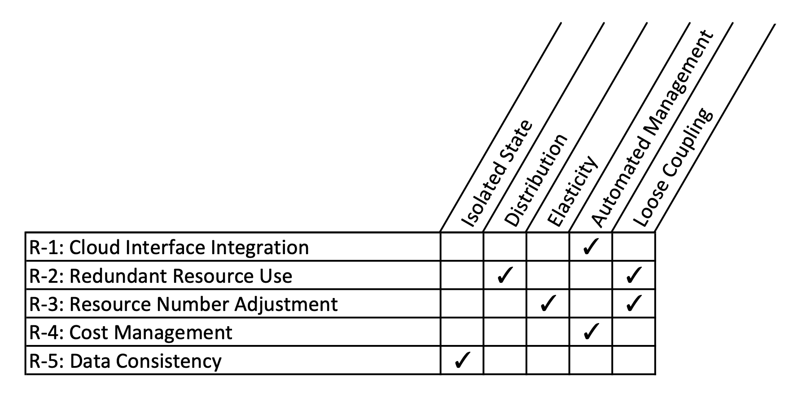
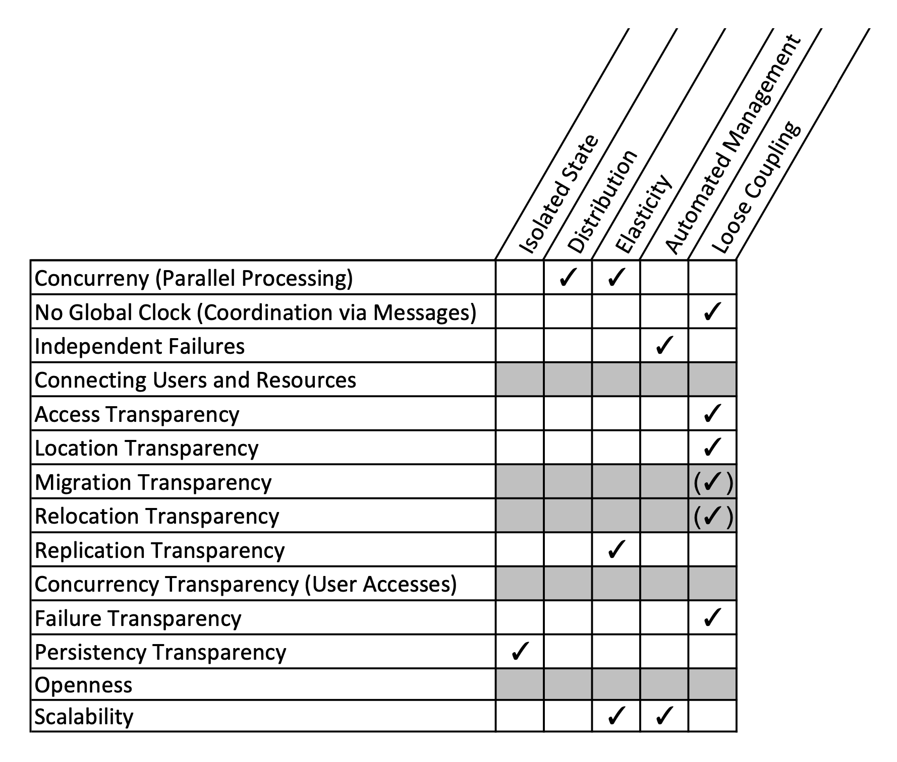
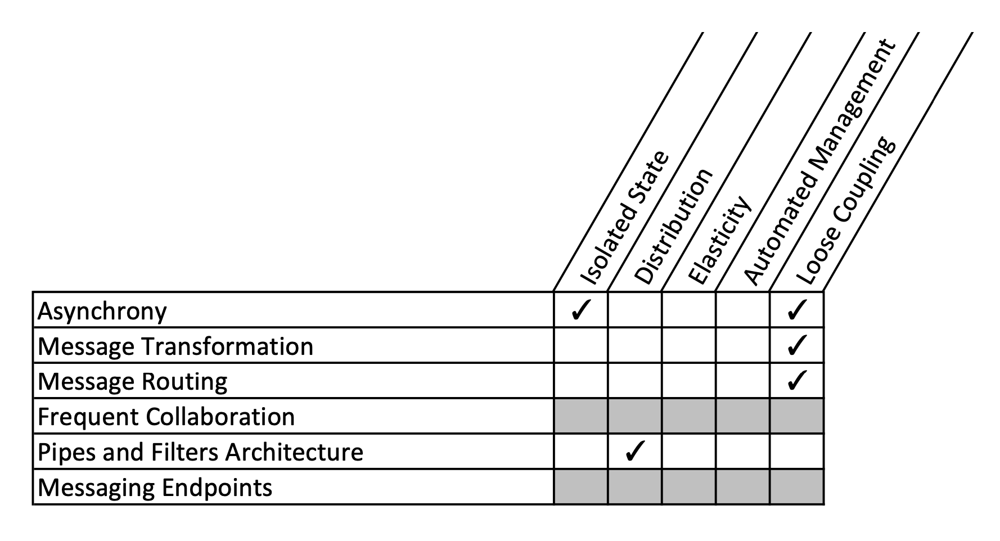
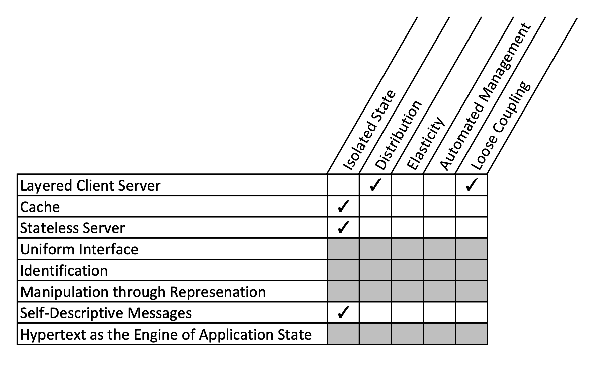
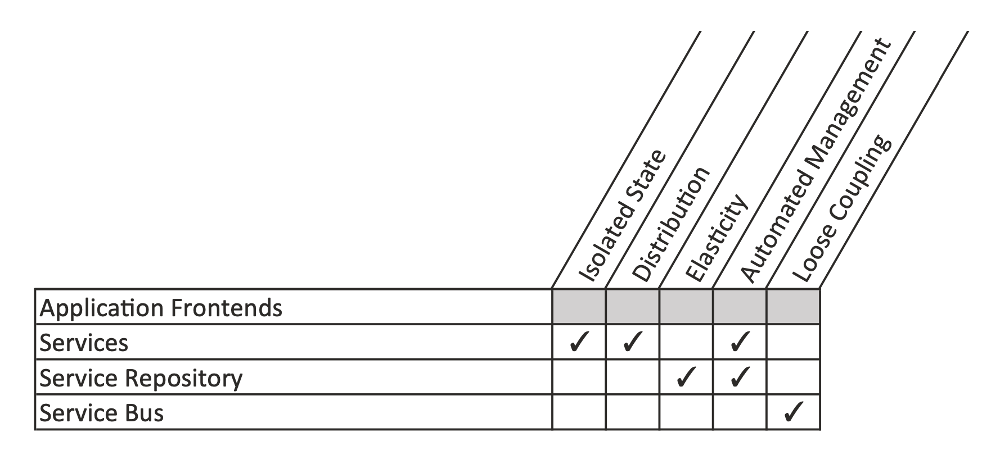

## _IDEAL_ Cloud Application Properties [[ref](https://d-nb.info/1079525432/34)]

* _**I**solated State_: state information (state of the interaction with an application and the data handled by the
  application) is handled by a minimal number of application components and preferably in data storage functionality
  offered by cloud providers. This isolation eases the scaling and ***resiliency***
  with respect to failures of the application.

* _**D**istribution_: the application functionality is spread out among multiple components to be deployed on multiple
  cloud resources. As the cloud environment is by nature a large distributed system, application functionality is
  distributed in a similar manner.

* _**E**lasticity_: the application is enabled to add and remove required resources during runtime. This addition and
  removal occurs without affecting the application user.

* _**A**utomated Management_: to react promptly to failures and changed resource demand, the corresponding management
  operations are automated and do not involve any human interaction.

* _**L**oose Coupling_: the dependencies among application components are reduced to ease addition and removal in the
  scope of elasticity management and ***resiliency***.

Mapping of _cloud environment requirements_ to cloud application properties:

Mapping of _distributed system properties_ to cloud application properties:

Mapping of _messaging properties_ to cloud application properties:

Mapping of _REST constraints_ to cloud application properties:

Mapping of _SOA concepts_ to cloud application properties:

