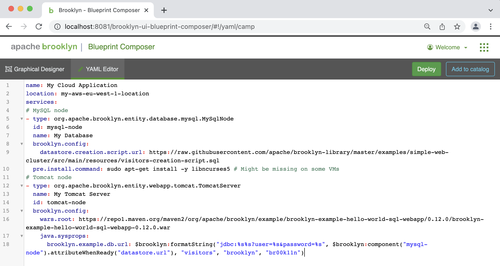

# Cloud Computing Tools

## Apache Brooklyn

Apache Brooklyn is a software for modeling, monitoring, and managing applications through autonomic blueprints across
cloud and non-cloud environments [[ref](https://brooklyn.apache.org/learnmore/theory.html)]. Brooklyn uses a YAML which
complies with CAMP syntax [[ref](http://docs.oasis-open.org/camp/camp-spec/v1.1/camp-spec-v1.1.html)].

Brooklyn blueprint can define application topology, application topology component and cloud or non-cloud location.
Blueprints can be added via web console or CLI.

Install Brooklyn CLI and start Brooklyn controller.

Create `my-location.brooklyn.yaml`:
```yaml
brooklyn.catalog:
  id: my-aws-eu-west-1-location
  name: 'My AWS EU West 1 location'
  itemType: location
  item:
    type: jclouds:aws-ec2
    brooklyn.config:
      region: eu-west-1
      identity: AWS_IDENTITY # replace
      credential: AWS_CREDENTIAL # replace
      loginUser: OS_LOGIN_USER # replace
      user: OS_USER # replace
      imageId: AWS_AMI_ID # replace
```
Add location to the Brooklyn catalog:
```shell
br catalog add my-location.brooklyn.yaml
```
Create `my-application.brooklyn.yaml`:
```yaml
name: My Cloud Application
location: my-aws-eu-west-1-location
services:
- type: org.apache.brooklyn.entity.webapp.tomcat.TomcatServer
  name: my-tomcat-server
  brooklyn.config:
    wars.root: https://repo1.maven.org/maven2/org/apache/brooklyn/example/brooklyn-example-hello-world-sql-webapp/0.12.0/brooklyn-example-hello-world-sql-webapp-0.12.0.war
```
Deploy application:
```shell
br catalog add my-location.brooklyn.yaml
```
Login into Brooklyn web console and inspect application deployment progress:


Indicators become green once application is successfully deployed:


Navigate to sensors of the `my-tomcat-server` entity and find `main.uri`:


Open link to see the Brooklyn sample web application:


Inspect with the CLI:

```shell
br locations
```

```shell
br applications
```

Try deploying same application topology from the composer:




